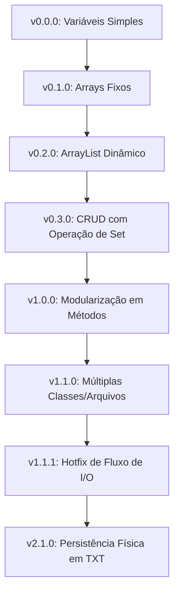

# 🚀 Agenda de Contatos

[](https://oracle.com)
[](https://wikipedia.org)
[](https://git-scm.com)

Um projeto didático e incremental desenvolvido para mapear, na prática, a evolução das boas práticas de engenharia de software e os pilares da **Programação Orientada a Objetos (POO)** em Java.

Mais do que uma simples agenda, este repositório funciona como uma **jornada de aprendizado cronológica**, onde cada versão atua como um degrau técnico, transformando um código procedural simples em uma aplicação modular, resiliente e com persistência de dados.

---

## 🎯 O Objetivo

O propósito central deste projeto é demonstrar visualmente como arquiteturas de software evoluem. Através de refatorações sucessivas, o sistema deixa de ser um script linear de um único arquivo para se tornar um ecossistema organizado sob o princípio de **responsabilidade única**, tratamento de exceções robusto e armazenamento físico.

---

## 🗺️ A Jornada de Evolução (Histórico de Commits e Tags)

O software foi desenvolvido de forma incremental, dividindo-se em fases de maturação técnica:



### 📁 Detalhamento das Versões

#### 🔄 Fase 0: Fundamentos e Estruturas de Dados
*   **`v0.0.0` — Programação Procedural Básica:** Abordagem puramente estruturada. Todo o fluxo concentrado no método `main()`, permitindo salvar apenas um único contato por execução. Foco no domínio de estruturas de controle (`switch-case`, `while`, `if-else`).
*   **`v0.1.0` — Arrays e Capacidade Fixa:** Introdução de arrays estáticos (`String[] nome`, `String[] celular`) para múltiplos contatos. Estudo de busca sequencial, controle de índice atual e o desafio da reorganização física de memória na exclusão de itens.
*   **`v0.2.0` — Armazenamento Dinâmico com ArrayList:** Substituição de vetores fixos pela API de Coleções do Java (`List` e `ArrayList`). Primeiros passos com *Generics* (`<String>`) e iterações modernas com `for-each`.
*   **`v0.3.0` — Atualização de Registros:** Implementação da peça que faltava para o CRUD: a alteração de registros existentes através de busca prévia do índice e atualização usando o método `set()`.

#### 🧩 Fase 1: Arquitetura, Métodos e Organização
*   **`v1.0.0` — Modularização com Métodos:** Refatoração do código massivo em blocos específicos (`adicionar()`, `listar()`, `pesquisar()`). Estudo prático de escopo de variáveis, passagem de parâmetros, assinaturas e legibilidade.
*   **`v1.1.0` — Modularização em Múltiplos Arquivos:** Quebra da classe única em múltiplos arquivos. Criação de camadas dedicadas para funções auxiliares (`Uteis`) e gerenciamento de dados (`Agenda`), isolando a interface de console (UI) da lógica de negócios.
*   **`v1.1.1` — Correção de Bug (Hotfix):** Engenharia de refinamento focada em vazamento de memória (*resource leak*), garantindo o fechamento correto do fluxo do `Scanner` (`scanner.close()`) durante o encerramento do sistema.

#### 💾 Fase 2: Persistência e Robustez
*   **`v2.1.0` (Versão Atual) — Persistência de Dados em Arquivo Texto (TXT):** Integração com a API `java.io`. Os dados agora sobrevivem ao encerramento da aplicação, sendo sincronizados em tempo real em um arquivo `agenda.txt` via `BufferedReader` e `PrintWriter`. Introdução ao tratamento de exceções com blocos `try-catch` e `IOException`.

---

## 🛠️ Tecnologias e Conceitos Absorvidos

*   **Linguagem:** Java (OpenJDK)
*   **Estruturas de Dados:** Arrays Fixos e Coleções Dinâmicas (`ArrayList`)
*   **Paradigmas:** Programação Estruturada ➡️ Programação Orientada a Objetos
*   **Arquitetura:** Separação de conceitos (Interface de Console isolada da Lógica)
*   **Manipulação de Arquivos:** Persistência em disco via Fluxos de I/O Java (`FileReader`, `FileWriter`)
*   **Versionamento:** Controle fino de histórico através de Tags Git

---

## 💻 Estrutura de Código da Versão Atual (`v2.1.0`)

Abaixo está a visualização simplificada da arquitetura atual do projeto, demonstrando o uso de métodos utilitários, divisão de classes e persistência em arquivos:

```java
// Exemplo ilustrativo do fluxo de Persistência na v2.1.0
public void salvarContatosEmArquivo() {
    try (PrintWriter writer = new PrintWriter(new FileWriter("agenda.txt"))) {
        for (int i = 0; i < nomes.size(); i++) {
            writer.println(nomes.get(i) + ";" + celulares.get(i) + ";" + emails.get(i));
        }
    } catch (IOException e) {
        System.err.println("Erro ao salvar dados: " + e.getMessage());
    }
}
```

---

## 🚀 Como Navegar e Executar Este Projeto

O histórico deste repositório foi construído para ser lido como um livro. Você pode viajar no tempo e analisar o código de qualquer versão utilizando as tags do Git.

### 📌 Mudando entre as Versões

Para analisar o código de uma fase específica (por exemplo, a primeira versão utilizando ArrayLists `v0.2.0`), use o comando:

```bash
git checkout v0.0.2.0
```

Para retornar à versão mais recente, estável e atualizada:

```bash
git checkout main
```

### ⚙️ Executando a Versão Atual (`v2.1.0`)

1. **Clone o repositório:**
   ```bash
   git clone https://github.com
   ```
2. **Navegue até o diretório do projeto:**
   ```bash
   cd agenda-contatos-poo
   ```
3. **Compile todos os arquivos `.java`:**
   ```bash
   javac *.java
   ```
4. **Execute a aplicação principal:**
   ```bash
   java Principal
   ```

---

## 🔮 Próximos Passos (Backlog de Evolução)

O aprendizado não para. As próximas metas traçadas para este ecossistema de estudo incluem:

- [ ] **v3.0.0 (Próxima Versão):** Transição completa para POO real. Criação da classe entidade `Contato` (reunindo os atributos encapsulados `nome`, `celular` e `email` com getters/setters) e uso de uma única lista `List<Contato>`.
- [ ] **v4.0.0:** Substituição do arquivo TXT por um Banco de Dados Relacional (SQLite/MySQL) utilizando **JDBC**.
- [ ] **v5.0.0:** Substituição da interface de terminal por uma Interface Gráfica moderna (**JavaFX** ou **Swing**).

---
*Desenvolvido com foco em evolução de arquitetura de código e consolidação de engenharia de software académica.* 🚀
